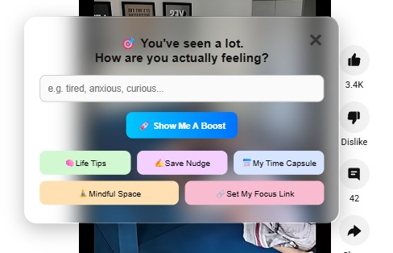
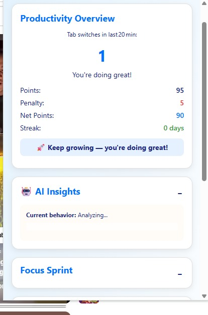
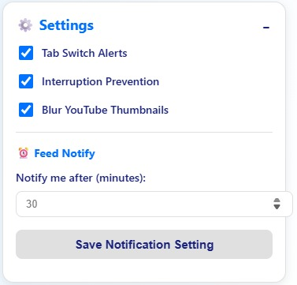
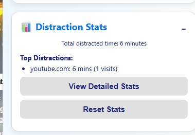

# BeFocused (ExtensionRaptor) 🚀

A next-generation Chrome extension to help you reclaim your focus, defeat digital distractions, and build mindful, productive habits. BeFocused combines real-time monitoring, motivational nudges, analytics, and beautiful UI to empower you to do your best work—every day.

---

## 📑 Table of Contents

1. [Project Summary](#project-summary)
2. [Features](#features)
   - [Focus Dashboard](#focus-dashboard)
   - [Tab Switch & Distraction Monitoring](#tab-switch--distraction-monitoring)
   - [Focus Sprint (Pomodoro)](#focus-sprint-pomodoro)
   - [Mindful Feed Overlay & Nudges](#mindful-feed-overlay--nudges)
   - [Focus Mode](#focus-mode)
   - [Stats & Analytics](#stats--analytics)
   - [Dark Mode](#dark-mode)
   - [Customization & Settings](#customization--settings)
3. [File Structure](#file-structure)
4. [Deployment](#deployment)
5. [Contribution Guide](#contribution-guide)

---

## 📝 Project Summary

**BeFocused** is your digital accountability partner. It tracks your tab activity, blocks distractions, delivers personalized motivation, and visualizes your progress—all in a seamless, modern interface. Whether you're a student, professional, or anyone seeking better digital habits, BeFocused helps you:

- Stay on task and avoid mindless browsing
- Build streaks and earn rewards for focus
- Get timely, mood-based nudges and life tips
- Visualize your productivity and distractions
- Personalize your experience with dark mode and custom settings

---

## ✨ Features

### 🧠 Focus Dashboard
- **Central popup** with all controls, stats, and quick actions.
- **Motivational status** and streaks to keep you inspired.
- **One-click toggles** for alerts, time-warp, and YouTube blur.

### 🔄 Tab Switch & Distraction Monitoring
- **Real-time tab switch counter**: See how often you switch tabs in the last 20 minutes.
- **Customizable alerts**: Get notified if you exceed your focus threshold.
- **Distraction time tracking**: Monitors time spent on distracting sites and gives warnings/penalties.
- **Penalty and reward system**:
  - Lose points for distractions
  - Gain points for focus
  - Daily streaks for consistent productivity

### ⏳ Focus Sprint (Pomodoro)
- **Start/stop 25-minute sprints** (Pomodoro technique) from the popup.
- **Blocks distracting content** (YouTube Shorts, Instagram Reels, Facebook Watch, Netflix, etc.) during sprints.
- **Floating stop button** and visual progress bar on active tabs.
- **Automatic break suggestion** and reward on completion.
- **Confetti and celebration** for completed sprints!

### 🧘 Mindful Feed Overlay & Nudges
- **Intentional Feed Overlay**: After a set time on supported sites, an overlay asks how you feel and offers:
  - **Personalized motivational quotes** (by mood: tired, bored, inspired, etc.)
  - **Life tips** and micro-actions to reset your mind
  - **Save a nudge**: Write a message to your future self
  - **Time Capsule**: View and manage your saved nudges
  - **Focus Link**: Save and quickly access a meaningful link (e.g., reading list, journal)
  - **Pin quotes** to your screen for ongoing motivation
- **Customizable interval**: Set how many minutes before the overlay appears ("Feed Notify").
- **Gentle sound and animation** to break the scroll loop.

### 🛡️ Focus Mode
- **Allow only a specific site** for a set duration (e.g., only docs.google.com for 30 minutes).
- **Blocks all other sites** during focus mode.
- **Easy start/stop** from the popup.
- **Visual feedback** on allowed site and remaining time.

### 📊 Stats & Analytics
- **Distraction stats**: See time wasted and number of distracting sites visited.
- **Points, penalties, and streaks**: Visualize your productivity trends.
- **Full stats page**: Detailed analytics and charts (powered by Chart.js).
- **Reset stats** with one click.

### 🌙 Dark Mode
- **Toggle dark mode** from the popup (bottom left).
- **Beautiful, accessible dark theme** for all UI elements.
- **Preference is saved** and persists across sessions.

### ⚙️ Customization & Settings
- **Settings page**: Adjust tab switch threshold, enable/disable sound alerts, force dark mode, and more.
- **Blur YouTube thumbnails**: Optional toggle to reduce visual temptation.
- **All preferences are saved** using Chrome storage.
- **Accessible, responsive UI** for all users.

---

## 🗂️ File Structure

```
ExtensionRaptor/
├── background.js           # Background logic: tab monitoring, notifications, points, penalties
├── block.html              # Block page for focus mode
├── break.html              # Break suggestion page after sprints
├── break.js                # Auto-close logic for break page
├── chart.min.js            # Chart.js library for stats
├── focusBlocker.js         # Content script for blocking non-allowed sites in focus mode
├── focusContent.js         # Content script for enforcing focus mode
├── focusSprint.js          # Content script for Pomodoro sprints and blocking distractions
├── icon.png                # Extension icon
├── intentionalFeed.js      # Main content script for overlays, nudges, quotes, and mindful features
├── manifest.json           # Chrome extension manifest (v3)
├── popup.css               # Styles for popup.html
├── popup.html              # Main popup UI (dashboard)
├── popup.js                # Logic for popup.html (UI, settings, dark mode, etc.)
├── settings.css            # Styles for settings.html
├── settings.html           # Settings page
├── setting.js              # Logic for settings page
├── stats.css               # Styles for stats.html
├── stats.html              # Stats and analytics page
├── stats.js                # Logic for stats page
├── style.css               # Shared/global styles
├── timeWarp.js             # Content script for time-warp/scroll-slowdown feature
├── ytblur.js               # Content script to blur YouTube thumbnails
```

---

## 🚀 Deployment

1. **Clone or download** this repository.
2. **Go to `chrome://extensions/`** in your Chrome browser.
3. **Enable Developer Mode** (top right).
4. **Click "Load unpacked"** and select the `ExtensionRaptor` folder.
5. The extension icon should appear in your browser bar. Click it to open the Focus Dashboard.

> **No build step is required. All files are ready for direct use in Chrome.**

---

## 🤝 Contribution Guide

We welcome contributions! To get started:

1. **Fork this repository** and clone your fork.
2. **Create a new branch** for your feature or bugfix:
   ```
   git checkout -b feature/your-feature-name
   ```
3. **Make your changes**. Please:
   - Keep code clean and well-commented.
   - Follow the existing file and code style.
   - Test your changes thoroughly.
4. **Commit and push** your branch.
5. **Open a Pull Request** on GitHub with a clear description of your changes and screenshots if relevant.

### Suggestions for Contribution

- New motivational quote categories or life tips
- UI/UX improvements (especially for dark mode or mobile)
- New analytics or productivity features
- Bug fixes or performance optimizations
- Translations/localization

**Questions or ideas?** Open an issue or start a discussion!

---

**Stay focused. Build your best self. 🦖✨**
---

## 🖼️ UI Previews

### 🌙 Dark Mode


### 📊 Distraction Stats


### 🛡️ Focus Mode


### 🚀 Launch & Main Dashboard


### ❗ Penalty Triggered


### ⚙️ Settings Panel


### ⏱️ Time Spent Analytics

